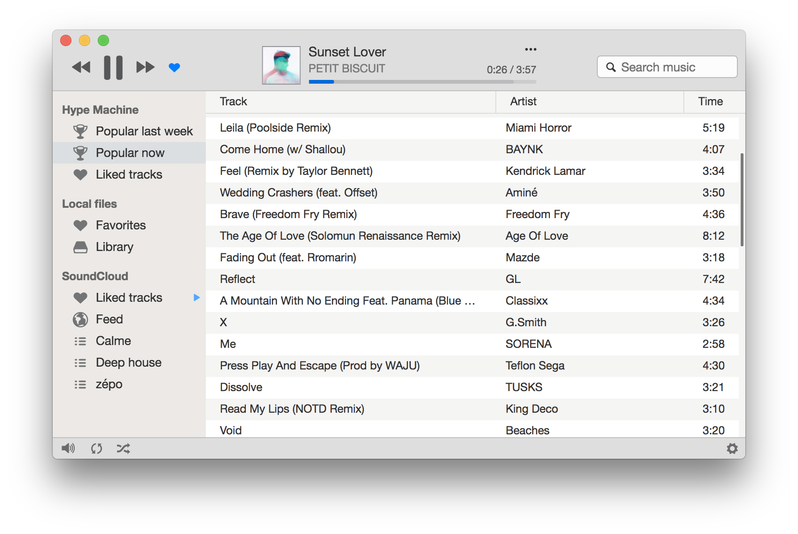

<p align="center">

</p>

<p align="center">
<a href="https://gitter.im/harmony-player/Lobby"></a>
<a href="https://github.com/vincelwt/harmony/releases/latest"></a>
<a href="https://www.paypal.com/cgi-bin/webscr?cmd=_s-xclick&hosted_button_id=XLQTUNFTN9FU8"></a>
<a href="https://flattr.com/submit/auto?user_id=vincelwt&url=https://github.com/vincelwt/harmony&title=harmony&language=&tags=github&category=software"></a>
</p>


<p align="center">

</p>

* Play tracks from SoundCloud, Google Play Music, Spotify, Deezer, Hype Machine or your local tracks
* All your playlists within the same app
* Sound menu integration or system tray for incompatible systems
* Last.fm scrobbling
* Super sleek interface
* Dark mode (Cmd/Ctrl + D)
* Keyboard control
* Distraction-free
* Background notifications


## Google Play Music 2 Factors auth

If you want to use Harmony with your Google account using 2-factors authentification, you can create a specific [app password](https://security.google.com/settings/security/apppasswords) or you  can (altough insecure and at your own risk) enable the insecure app access in [your Google account settings](https://myaccount.google.com/security?pli=1#connectedapps).

## Installation

You can download compiled versions of Harmony for Windows, Mac OS, and Linux (.deb) from [the website](http://getharmony.xyz).

**Mac OS (OSX):**

Run and install

**Windows:**

Run and install

**Linux:**

Use `sudo dpkg -i ` followed by the .deb file to install.


## Controls

**Ctrl/Cmd + D** -> Toggle Dark mode

**Space** -> Play/Pause

**N or Ctrl/Cmd + Right** -> Next track

**P or Ctrl/Cmd + Left** -> Prev track

**L** -> Like track

**Ctrl/Cmd + F** -> Search

## Contribute

You can suggest (or vote for) new features at [this page](http://ideas.getharmony.xyz).

If you found a bug, please post the bug [on this page](https://github.com/vincelwt/harmony/issues) and include if you can console's output and steps to reproduce the problem in your bug report.
You can enable full console output by running Harmony from command line with `--enable-logging` argument or pressing Alt+Cmd+I on Mac OS.

If you want to develop, you can look at the issues, especially the bugs and then try to fix them.

Or if you enjoyed using Harmony and would like to support the development, please consider making a donation.

[](https://www.paypal.com/cgi-bin/webscr?cmd=_s-xclick&hosted_button_id=XLQTUNFTN9FU8)

[](https://flattr.com/submit/auto?user_id=vincelwt&url=https://github.com/vincelwt/harmony&title=harmony&language=&tags=github&category=software)


## Development environment

To get a local development copy running, you will need:

- [npm][], usually installed with [node][]
- [git][], version control tool

[git]: http://git-scm.com/
[npm]: http://npmjs.org/
[node]: http://nodejs.org/

Follow the steps below to get a development copy set up:

```bash
# Clone our repository
git clone https://github.com/vincelwt/harmony.git
cd harmony/

# Install our dependencies and dev dependencies
npm install

# Start up
npm start
```

After running the above steps, a copy of Harmony should begin running.

## Thanks to 

[@moz17i](http://mo17i.tumblr.com/) for the logo and Github banner

[@w0xel](https://github.com/w0xel) for improvements on the Play Music plugin

[](https://packagecloud.io/) 
